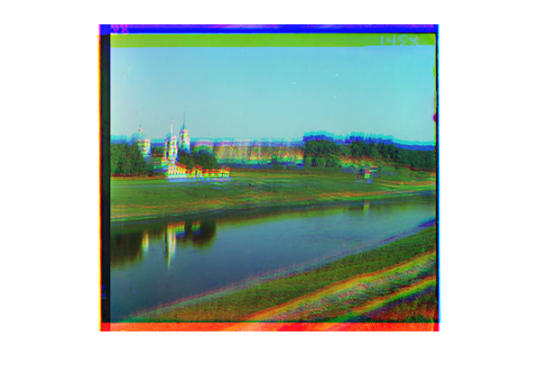

<h1 align="center">Computer-Vision</h1>

    <a href="https://twitter.com/theanaskhan">
    
 

<h4 align="center">The forgotten story of the images.</h4>

**Story behind the Image** Sergei Mikhailovich Prokudin-Gorskii (1863-1944) was a photographer who, between the years 1909-1915, traveled the Russian empire and took thousands of photos of everything he saw. He used an early color technology that involved recording three exposures of every scene onto a glass plate using a red, green, and blue filter. Back then, there was no way to print such photos, and they had to be displayed using a special projector.

Here, the goal was to work with images in Matlab by taking the digitized Prokudin-Gorskii glass plate images and automatically producing a color image.

